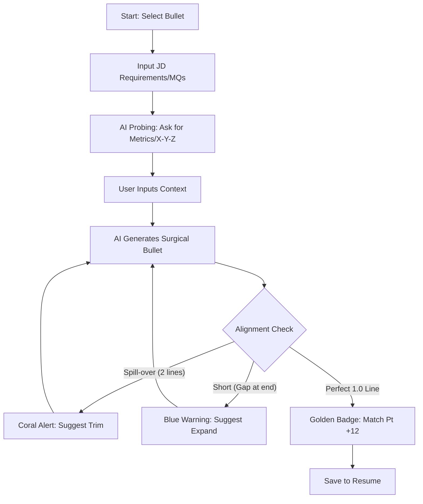
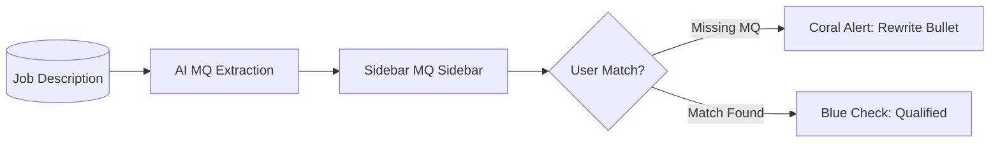

# UX Design Specification Resume personalisation (Sync)

**Author:** satvik
**Date:** 2026-02-11

---

## Executive Summary

### Project Vision

"Sync" ek **clean, efficient aur high-precision tool** hai. Iska design philosophy **Apple-style simplicity** aur **Google-style functional minimalism** par based hai. Humne focus resumes ki natural white background aur light colors par rakha hai taaki interface minimalist aur professional lage.

### Target Users

- **Satvik & Other Tech Professionals:** Jo clutter-free environment mein kaam karna pasand karte hain aur jinhe precision tools ki zaroorat hai.

### Key Design Challenges

- **The "Full-Width Rectangular Block":** Resume text aur bullets ko **exactly 1.0 line** mein fit karna aur unhe **full margin-to-margin** stretch (justify) karna. Trailing whitespace bilkul allowed nahi hai—text poora left margin se start hokar right margin par end hona chahiye.
- **Probing Questionnaire:** Multi-turn chat ko ek light-weight side-panel mein dikhana taaki resume focus mein rahe.
- **Visual Perfectness:** LaTeX fonts ki rendering ko pixel-accurate dikhana.

### Design Opportunities

- **Achromatic Palette:** White, light grays, aur soft accents.
- **Space-Driven Clarity:** High whitespace usage for focus.

---

## Core User Experience (Defining Interaction)

### 2.1 Defining Experience

"Sync" ki defining experience **"Full-Width Surgical Syncing"** hai. Ye sirf AI rewrite nahi hai; ye layout-aware surgical tailoring hai jo [Resume Golden Rules](file:///Users/satvikjain/Downloads/Resume%20personalisation/output/planning-artifacts/resume-golden-rules.md) ko enforce karti hai.

### 2.2 User Mental Model

Users "Sync" ko ek intelligent editor ki tarah dekhte hain jo layout ki chinta (margins, edge alignment) ko khatam kar deta hai, taaki wo sirf content quality aur impact par focus kar sakein.

### 2.3 Success Criteria

- **True Flush Alignment:** Har bullet exactly 1 line cover karta hai aur left-to-right margin tak full width cover karta hai.
- **Golden Rule Adherence:** 100% compliance with X-Y-Z formula, bullet grouping (2-3), and reverse chronological order.
- **Contextual Integrity:** AI suggestions hamesha user-provided facts par grounded rahen.
- **Loop Speed:** Core tailoring cycle < 20 seconds per bullet.

### 2.4 Novel UX Patterns

- **Full-Width Validation:** Ek subtle visual indicator jab text perfect rectangular block mein transform ho jata hai.
- **Embedded Probing:** Sidebar chat ke bajaye, content ke andar hi context seeking prompts.

### 2.5 Experience Mechanics

- **X-Y-Z Formula Alignment:** AI-Probing loop strictly follows: _"Accomplished [X] as measured by [Y], by doing [Z]"_. Interface prompts users specifically for [Y] (metrics).
- **JD-Specific Tailoring:** System highlights Minimum Qualifications (MQs) in the side-panel to ensure user verification.
- **Surgical Indentation:** All bullet points must have 100% consistent vertical alignment (identical margins) and horizontal full-width stretch.
- **Initiation:** Dashboard se "Precision Sync" trigger karna.
- **Interaction:** AI suggestions vs User edits with real-time alignment metrics.
- **Completion:** One-click transition for Overleaf export.

---

## Design System Foundation

### 1.1 Design System Choice

**Shadcn/UI (Themeable System) + Tailwind CSS.**

### Rationale for Selection

- **Speed to Market:** Shadcn/UI provides production-ready components.
- **Apple/Google Hybrid Aesthetic:** Shadcn's minimalist defaults are a perfect canvas for premium customization.
- **Developer Experience:** Tailwind CSS allows for high-precision styling.

### Customization Strategy

- **Typography:** Using Inter or San Francisco system fonts.
- **Color Palette:** Achromatic (White/Gray) with high functional whitespace, using Teal/Gold accents.
- **Radius:** 8px to 12px (Apple-style) for for a premium, softened feel.

---

## Desired Emotional Response

### Primary Emotional Goals

- **Precision & Mastery:** User ko mahsoos hona chahiye ki unke paas career tailoring ke liye ek surgical precision tool hai.
- **Calm Security:** Local-first architecture se unhe data privacy par 100% trust ho.
- **Professional Pride:** Final LaTeX output ki quality (clean blocks) dekh kar user apne profile par proud feel karein.

---

## UX Pattern Analysis & Inspiration

### Inspiring Products Analysis

- **Apple (Systems Design):** Layout clarity, high whitespace, and extremely smooth macOS-style animations.
- **Google (Functional Minimalism):** Clear information hierarchy and Material Design-inspired functional cues.

---

## Visual Design Foundation

### Color System (LinkRight Theme)

Hum **LinkRight** ki primary palette ko light achromatic background ke saath integrate karenge:

**Primary (Teal Family):**

- **Deep Teal (`#006666`):** Navigation bars, primary buttons.
- **Medium Teal (`#2699B8`):** Icons, secondary actions.

**Accents & Functional:**

- **Gold (`#FFD700`):** Premium features, specialized AI modes, and "High Mastery" badges.
- **Coral (`#E87D63`):** Critical alerts, layout warnings, or job-specific deadlines.
- **Success Blue (`#3b82f6`):** Replacing green for all "Sync Complete" and "Perfect Match" confirmations (Professional Blue).

**Foundation (Achromatic):**

- **Background:** Warm White (`#FDFCFB`) or Pure White (`#FFFFFF`).
- **Foreground:** Dark Blue-Gray (`#202938`) for text.
- **Surfaces:** Light Teal-tinted grays (`#F0F5F5`).

### Typography System

- **Typeface:** **Inter** for UI, **LaTeX-style serif** for Resume preview.
- **Scale:** High contrast between UI text and resume content.

### Spacing & Layout Foundation

- **The Rectangular Block Principle:** Layout elements (bullets, headers) must align edge-to-edge.
- **Airy Space:** High use of margin whitespace to separate tool panels from the central canvas.

---

## Design Direction Decision

### Design Directions Explored

Explored an **Apple/Google Hybrid Minimalism** using an achromatic foundation with **LinkRight** Teal/Gold/Coral accents. The core layout principle shifted from a manual ruler to a **"Rectangular Block"** alignment (Surgical Precision).

### Chosen Direction

**Direction: Surgical Achromatic with Teal Accents.**

- **Layout:** Edge-to-edge "Rectangular Block" for all resume bullets.
- **Palette:** Teal Primary, Blue Success, Golden Mastery (Limited Usage), and Coral Alerts.
- **Vibe:** Serious, High-Performance, and Airy.

### Design Rationale

- **Mastery:** Gold is used specifically for "Mastery" moments (e.g., successful edge-alignment) to provide high-value dopamine without cluttering the UI.
- **Professionalism:** Success Blue replaces green to maintain a technical, engineering-focused aesthetic.
- **Clarity:** High whitespace usage ensures the resume remains the central focus.

### Implementation Approach

Utilizing **Shadcn/UI** as the component base, with custom **Tailwind CSS** utilities for the justified "Rectangular Block" text treatment and glassmorphism side-panels.

---

## User Journey Flows

### 3.1 The "Surgical Sync" Loop

Is journey ka goal hai base-bullet ko JD ke hisab se perfectly tailor karna.

### 3.2 The "MQs Verification" Flow

Ensure karna ki resume strictly Job Description ki minimum requirements ko meet karta hai.

### 3.3 Journey Patterns

- **High-Velocity Tailoring:** Keyboard shortcuts (`Cmd+S`) for rapid sync.
- **Visual Coaching:** Interface user ko guide karti hai (too short -> expand, too long -> trim).
- **Metric Hunting:** AI Probing hamesha "Y" (measured result) ko dhoondhta hai.

### 3.4 Flow Optimization Principles

- **Zero Fluff:** Bullet generation engine words select karte waqt brevity ko rank deta hai.
- **Symmetry Lock:** Indentation vertical lines hamesha locked rehti hain sync mode mein.

---

## Component Strategy

### 4.1 Design System Components (Shadcn/UI)

Hum baseline interaction ke liye standard Shadcn components use karenge:

- **Navigation:** Menus aur Navigation links.
- **Feedback:** Toasts (Success Blue), Alerts (Coral), aur Progress bars.
- **Overlays:** Dialogs (for JD upload) aur Popovers (for X-Y-Z hints).
- **Layout:** Resizable Panels (Split-view canvas structure).

### 4.2 Custom "Surgical" Components

"Sync" ki unique requirements ke liye bespoke components chahiye:

#### 1. The SyncCanvas

- **Purpose:** A4-width resume preview jahan bullets perfectly justified hote hain.
- **Key Feature:** Real-time margin-to-margin enforcement (`text-align-last: justify`).

#### 2. XYZ-OptimizationSidebar

- **Purpose:** AI-Probing interface jo user se Metrics (Y) aur Methods (Z) extract karta hai.
- **Interaction:** Contextual input fields jo current-bullet status dikhati hain.

#### 3. Pro-MasteryHUD (Heads-Up Display)

- **Purpose:** Subtle overlay jo "Match Pt +12" aur "Golden Rule Check" dikhata hai.
- **Usage:** Limited golden accents for high-impact achievements.

### 4.3 Component Implementation Strategy

- **Tokens:** Shadcn theme variables ko LinkRight Teal/Gold palette ke saath map karna.
- **Precision Styling:** Tailwind's `tracking-tight` aur custom `leading` properties ka use karke LaTeX-like feel dena.
- **Accessibility:** Radix primitives ka use karke keyboard-first navigation (Tab through bullets) implement karna.

### 4.4 Implementation Roadmap

- **Phase 1 (MVP):** SyncCanvas (Justified text) + XYZ-Sidebar basics.
- **Phase 2 (Polish):** Pro-Mastery HUD + Animated transitions.
- **Phase 3 (Scale):** Advanced MQs checker + Multi-template support.

---

## UX Consistency Patterns

### 5.1 Button Hierarchy & Actions

- **Primary Action (Teal `#006666`):** "Sync Bullet", "Export to Overleaf". Hamesha prominent aur single main action.
- **Secondary Action (Gray):** "Reset Changes", "Next Project".
- **Surgical Suggestion (Success Blue):** "Auto-Trim to 1 Line".

### 5.2 Feedback Patterns (The Surgical Signal System)

- **Success (Blue `#3B82F6`):** Jab bullet point "Rectangular Block" rules ko perfectly meet kare.
- **Warning/Error (Coral `#E87D63`):** Jab text overflow ho ya MQs missing hon.
- **Mastery (Gold `#FFD700`):** Jab users poora project "Golden Rules" compliant bana lein. (Limited use to prevent clutter).

### 5.3 Formatting & Indentation Patterns

- **The Indent-Lock:** Har bullet level ki indentation vertically aligned honi chahiye. Ek bullet move karne par baaki sab in-sync rehne chahiye.
- **Justification Sync:** "Sync" mode active hone par, `text-align-last: justify` hamesha enabled rahega taaki true edge-to-edge look aaye.

### 5.4 Modal & Overlay Patterns

- **Achromatic Modals:** Context switching ke liye pure white overlays with 12px rounded corners (Apple-style).
- **Probing Popovers:** AI Sawal (Metrics capture) hamesha editing bullet ke bilkul niche ya side mein aayenge.

---

## Responsive Design & Accessibility

### 6.1 Responsive Strategy

"Sync" ek precision tool hai, isliye hamari strategy **"Desktop-First for Editing"** aur **"Mobile-First for Review"** hai.

- **Desktop (Main Hub):** Split-view environment. Sidebar (Left) for AI tools and Canvas (Right) for surgical resume preview.
- **Tablet:** Sidebar automatic collapse hota hai into a drawer to maximize resume visibility.
- **Mobile:** Tailoring workflow ko ek simplified mobile-wizard mein convert kiya gaya hai. Focus "Approval" aur "Quick Edits" par hai, na ki full document structure control par.

### 6.2 Breakpoint Strategy

- **Surgical Desktop (>= 1280px):** Full split-view experience.
- **Compact View (768px - 1279px):** Auto-collapsing sidebars.
- **Review Mobile (< 768px):** Single-column stack with bottom action bar.

### 6.3 Accessibility Strategy (WCAG Level AA)

- **Keyboard-First:** `Tab` for bullet switching and `Cmd/Ctrl + Enter` to "Apply Sync".
- **Color Contrast:** Deep Teal (`#006666`) on Warm White passes AA standards for readability.
- **A11y Labels:** Har "Surgical Block" ka ek aria-label hoga jo current "Fitting Status" (Matched/Trim-needed) announce karega.

### 6.4 Testing Strategy

- **Responsive:** Automated checking across Chrome/Safari (Apple focus) using developer tools.
- **A11y:** AXE-core automated scans + Manual keyboard-only walkthroughs.

### 6.5 Implementation Guidelines

- **Units:** Space metrics ke liye `rem` aur `clamp()` ka use (for fluid typography).
- **Touch Targets:** Buttons hamesha minimum 44px height ke honge on mobile devices.

---

## 7. Workflow Completion

The UX Design specification for "Sync" is now finalized. This document serves as the "Surgical Blueprint" for the implementation phase.

- **Design Approved:** Achromatic (Warm White/Teal) with Surgical Blue success states.
- **Rules Finalized:** Strict adherence to [Resume Golden Rules](file:///Users/satvikjain/Downloads/Resume%20personalisation/output/planning-artifacts/resume-golden-rules.md).
- **Core Loop Locked:** X-Y-Z formula based AI-Probing + Edge-to-Edge Justification.

---

**END OF UX SPECIFICATION**
